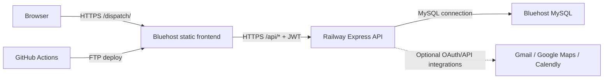

# Architecture

This document describes the repository as audited on June 17, 2026. It distinguishes the deployed application from an unfinished alternate implementation so future work does not accidentally combine two incompatible stacks.

## Deployed runtime

### Frontend

- Entry point: `client/src/main.jsx`
- Active application: `client/src/App.jsx`
- Framework: React 18 built by Vite 5
- Styling: Tailwind CSS 3 plus application CSS
- Production base path: `/dispatch/`
- API origin: compile-time public variable `VITE_API_URL`
- Authentication state: JWT stored in browser `localStorage`

`client/src/pages/`, `client/src/components/`, `client/src/context/`, and `client/src/lib/api.js` contain a second router/context implementation that is not mounted by `main.jsx`. Those files should be treated as inactive until their useful behavior is deliberately reconciled with the active application.

### API

- Entry point: `server/index.js`
- Framework: Express 4 using CommonJS modules
- Authentication: one configured administrator; login returns a signed JWT
- Production persistence: MySQL through `mysql2`
- Local persistence: SQLite through `better-sqlite3`
- Scheduled work: `node-cron`

Route groups registered by the server:

| Prefix | Purpose | Authentication |
| --- | --- | --- |
| `/api/health` | Health status | Public |
| `/api/auth` | Login and current-user lookup | Login public; current user protected |
| `/api/workorders` | Work-order CRUD, statistics, board data, scheduling, sending | Protected |
| `/api/gmail` | OAuth status, authorization, sync, disconnect, callback | Mostly protected; callback public |
| `/api/calendly` | Status and webhook handling | Status protected; webhook public |
| `/api/routes` | Route generation | Protected |
| `/api/analytics` | Operational metrics | Protected |
| `/api/settings` | Application settings | Protected |
| `/api/ai` | Legacy Anthropic categorization | Protected, but prohibited by project policy |

The `/api/ai` route is an architectural and policy violation. It must not be configured or called. Its removal should be the first approved functional cleanup.

### Authentication flow

1. The browser sends credentials to `POST /api/auth/login`.
2. The API compares them to administrator environment configuration or unsafe built-in development fallbacks.
3. The API signs a JWT and returns it to the browser.
4. The browser stores the token in `localStorage` and sends it as `Authorization: Bearer ...`.
5. Protected middleware verifies the token. There is no persistent user table, role model, refresh-token flow, or server-side session invalidation.

This is single-administrator authentication, not role-based access control.

## Production MySQL model

`server/schema.sql` defines four tables:

| Table | Responsibility | Relationship |
| --- | --- | --- |
| `work_orders` | Work request, resident/contact, address/unit, status, priority, scheduling, notes, email metadata | Parent of `email_logs` |
| `email_logs` | Outbound/inbound communication metadata | Optional foreign key to `work_orders.id` |
| `settings` | Key/value application settings | Standalone |
| `gmail_tokens` | Gmail OAuth token data | Standalone singleton-style storage |

Property, unit, tenant, technician, user, role, attachment, and normalized history tables do not exist in this production model. Some of those concepts are flattened into `work_orders`, and technician assignment submitted by the UI is not persisted by the API schema/allowlist.

The current code attempts to initialize the schema automatically at startup. It is not a versioned migration system. Several queries use SQLite-specific syntax even when the MySQL adapter is selected, including date functions and `ON CONFLICT`, so MySQL behavior is not reliably covered by local tests.

## Unfinished alternate application

The repository root contains Next.js 16, React 19, Supabase/Postgres migrations, and a separate component set under `src/`. Its data model includes profiles, roles, properties, tenants, work orders, status history, appointments, communications, imports, attachments, integration credentials, public action tokens, ratings, and webhook events with row-level security.

That model is more extensive, but it is not the stated or deployed Railway/MySQL architecture. The root build currently fails because `next-themes` and `sonner` are imported but undeclared. This application must remain inactive until the owner explicitly chooses whether to archive it, harvest selected designs, or migrate stacks.

## External integrations

- Gmail OAuth and inbox synchronization
- Calendly event links and webhook processing
- Google Maps route lookup
- SMTP/email behavior through Nodemailer

OAuth tokens are currently stored directly in MySQL. The Gmail callback lacks a verified OAuth `state` value, and the webhook is accepted without signature verification when its signing secret is absent. These integrations require hardening before broader use.

## Current boundaries

- The frontend must receive only intentionally public build values such as `VITE_API_URL`.
- Database, JWT, OAuth, mail, webhook, and maps credentials belong only in Railway environment variables.
- The application must not use Anthropic, OpenAI, Gemini, or another paid AI API.
- Rule-based categorization should extend the existing keyword/parser approach with deterministic, testable rules.
- WordPress databases and unrelated Bluehost files are out of scope.
